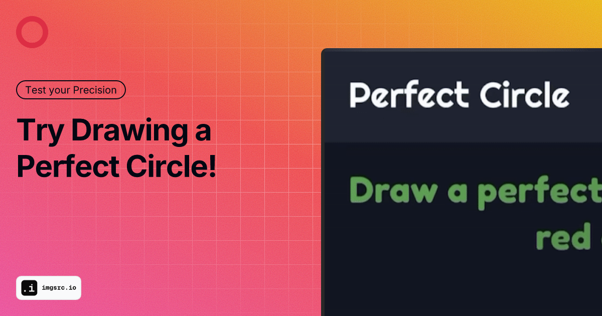
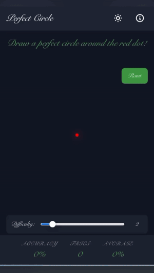

# 🎯 Perfect Circle Game


Ever wondered how steady your hand is? Well, I got bored one day and decided to find out! Welcome to Perfect Circle - a simple yet addictive game that challenges you to draw the most perfect circle possible.


*Figure: screenshot of the Perfect Circle Game.*

## 🎮 The Game

Draw circles. That's it! But here's the catch - they need to be *perfect*. The game calculates your accuracy based on how close your drawing matches a mathematically perfect circle. Features include:

- Real-time accuracy calculation
- Adjustable difficulty levels
- Dark mode support
- Stats tracking (tries and average accuracy)
- Responsive design that works on both desktop and mobile




*Figure: A demo of the Perfect Circle Game in action.*

## 🚀 Quick Start

### Clone the Repository

Clone the repository to run or build docker image locally:

```bash
# Pull github repo
git clone https://github.com/sharf-shawon/circle-game.git

# navigate to the repo directory
cd circle-game
```


### Using Docker (Recommended)

The game is containerized and available on Docker Hub. To run it:

```bash
# Pull and run using docker-compose
docker-compose up -d

# Or build and run locally
docker-compose up -d --build
```

The game will be available at `http://localhost:8687`

### Manual Setup

Just open `index.html` in your browser - that's it! No build process, no dependencies.

## 🛠️ Technical Details

- Built with vanilla JavaScript and HTML5 Canvas
- Styled with Tailwind CSS
- Containerized with Nginx Alpine
- Fully client-side (no backend required)

## 🤔 Why?

Because why not? I came across this game, and thought I could improve it a little bit more. So here is my attempt. This little game turned out to be a fun way to test hand-eye coordination and precision.

## 📝 License

Feel free to use this however you want! Share it, modify it, or just use it to procrastinate - I won't judge.

---
Made with ☕ by Sharfuddin Shawon
